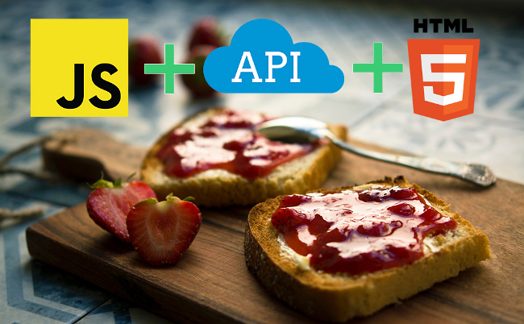
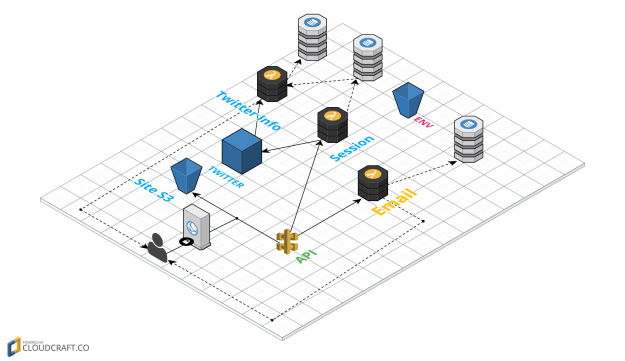

You probably came to this blogpost wondering how is this possible, what kind of sorcery
allows you to have a application work without servers? Well, in this post I am going to show
you how this is possible! 

One of the main things that comes up when you look up serverless is JAM stack, and no this is not just a bunch of jam jars stacked on top of each other, but an equally yummy stack of JavaScript, API’s and Markup. This is the basis of what servless is built on. 

##  **What is the JAM stack ?**
------

According to the official definition it is a modern web development architecture based on client-side JavaScript, reusable APIs, and prebuilt Markup.

Serverless allows you to build applications without the use of servers. The JAM stack does not refer to specific languages, databases or operating systems, but rather the way you build the website or app: by not using servers as described in the name. So this means there are many options for databases and frameworks you can use for JAM stack.

So now that you know about the JAM stack I can tell you what makes it so awesome!  

## **What makes JAM stack so great?!**
------

* **Better performance**

   With JAM stack the sites files are hosted over a CDN (content delivery network) 
   which means that it can be hosted across multiple servers all over the world. This 
   decreases loading time and gives minimal latency, so you can have better
  performance on your site!

* **Higher Security**

    The server-side processes are handled by microservice APIs . This means you leave
    most of the security in the expert hands of the people who wrote these services so
    between your crazy deadlines and coffee addiction this is one less thing you have to
    worry about.
  

* **Cheaper and easier scaling**
 
    With your files being hosted over CDN it means you already have load balancing
    covered. So your JAM stack site will be able to keep up no matter how many users
    connect to your website concurrently. The services that you use with JAM stack are
    very cheap to use and depending on the amount of operations and size of the app
    most of these services are free.
 

* **Better developer experience**
   
   Yes it is developer-friendly: you will not have to worry about keeping servers up and 
   running, which is a big plus point. You can leave this up to the API services that you
   are consuming, which makes it easier for devs to sleep at night without having to worry about the server being down.
 

Image Source ~(https://storage.googleapis.com/cdn.thenewstack.io/media/2017/12/537f29bc-42350470-jamstack.jpg) 

## **My experience using JAM stack**
------
When I heard about this I had the need to explore this further and experience firsthand what all the hype is about. I came across a bunch of tutorials on JAM stack. There were so many it was quite hard to choose so I ended up going with the one that covered most of what the JAM stack has to offer.

With JAM stack you have a lot of open-source frameworks and languages to choose from. This helps you to choose a framework you might be familiar with and decrease the learning curve that you have to learn JAM stack.

The tutorial that stuck out the most for me was a tutorial from J-Bytes, who had to create a POC (Proof Of Concept) for a project where he compared the serverless stack to one with a Node server. This was perfect to see if using this technology would be worth it. The tutorial guides you to make a Twitter/email campaign page using serverless technology. This is a very simple site and running a server for this seems like overkill. The clouds are already full of them so why add another one,right? You can follow the tutorial here
(http://robsherling.com/jbytes/index.php/2017/01/08/serverless-backends-with-aws-cloud-installs/)

When I began this, I realised how important a role AWS plays in this tutorial which uses lots of AWS services like IAM for authentication, S3 for the site hosting , API gateway for the api calls, AWS lambda for lambda functions, and dynamodb for saving the emails. You can practically handle all of your server side operations on AWS and at a very reasonable cost. You can also use other platforms like Azure, Google cloud platform and IBM for these services.  

Learning lambda was not too steep of a learning curve and I could get the hang of it in a day. I already had experience with JavaScript wich was very beneficial so if you don't have experience it might take you a bit longer but it was pretty straightforward to grasp. So in the ever-learning dev world, you can take a slight break from having to learn everything from scratch. 

One of the important things I learned is to have static configuration files for each of your environments so you can easily setup a CI (Continuous Integration) pipeline to publish to your production environment and staging environments (oh yes all the buzzwords). It was a fun experience, and I encourage you to try it out as well. Below is a map of how all the services are connected with the serverless stack from the tutorial .

Image Source ~ (https://i0.wp.com/robsherling.com/jbytes/wp-content/uploads/2017/01/LamdaTwitter.png?w=625)

## **The tech that I found to be useful when building a serverless application**
------

While doing this I came across a lot of tech that you can use to create your serverless application, so here is a list of tech that I found to stand out:

* **Lambda:**

    Lambda expressions allows you to run code without having a server and scales as you need to make more requests, The free tier, depending on the service that you use, ranges from 1-2 million requests per day which seems to be plenty, considering that there are 86400 seconds in a day -- you will need to invoke a function way more than once every second to reach this cap. Lambda supports Node.js, Java, C#, Go and Python, so you should be able to find a language that you might know.

* **Cloud hosted NoSQL DB:**

   Your cloud hosted NoSql db will allow you to have a database without the hassle of having a server, which is the point of serverless, and they are quite cheap. These databases are easily scalable so you don’t need to worry about how much data you are storing.

* **Storage and content delivery:**

   Your website is hosted through a CDN (Content Delivery Network) when using serverless which allows you to get the lowest latency for the people who access your website. This decreases the loading times and makes your website a lot faster! So all-round awesome to use. You get about 5GB of storage for free on average, depending on the service you use.

* **API Gateway:**

   This will help you handle incoming and outgoing API requests and authorisation, and just make your life easier all-round when handling API requests. This is free for the first million requests each month on average so again this is quite cheap and not easy to deplete.

* **IAM:** 

  This provides identity and access management services., If you want to have users log in on your site, this will help you manage your users mostly.

## **What would I create using Serverless?**
------

What I have seen and experienced from serverless is that it is great for small projects that aren't incredibly complex. You can build a simple website to gather people's information or you can use it for your pet projects. The cost of this is very attractive if you want to make something simple and still need some server side services - like storage for example. So if you have a low-budget simple website or app that you want to create, JAM Stack would be perfect.

There are a lot of frameworks using serverless that have specific templating for blogs, with CMS so you can easily create a blog with a CMS running client-side which cuts the servers out of the picture. This cuts costs, especially for someone who wants to create a very custom blog site, but does not want to spend a lot of money on the maintenance of their blog’s hosting. I have also seen serverless sites being used for documentation, knowledge bases, manuals and wiki’s. The possibilities are endless. 

## **Now go out there and try things!**
------

Yes, now that you know a little more about serverless, I encourage you to go try creating something using the JAM stack - and no I don’t mean Jam sandwich - but I hope you know this by now and I hope I to have sparked some interest into the JAM stack . If you would like to check out some of the frameworks you can use you can go here:
(https://www.netlify.com/blog/2017/05/25/top-ten-static-site-generators-of-2017/) 
they compiled a list of the top 10 serverless frameworks of 2017 that you can try. Don’t be scared to get your creative juices flowing. 

So now go out there and stop polluting the clouds with Linux servers - use serverless instead!
