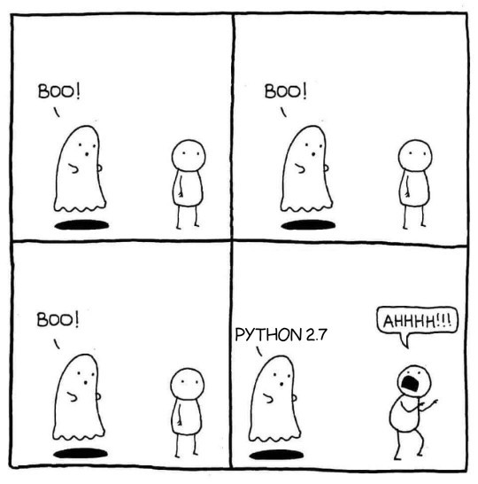

## **What is Docker, and why is there such a big hype around it 🐋?**
------

Well, I am here today to tell you what docker is, and more specifically containerisation. So just like you get SaaS (Software as a Service), PaaS (Platform as a Service) and IaaS (Infrastructure as a Service) you now get CaaS (Containers as a Service) which is a service provided by Docker.

Docker is the main containerisation platform that allows you to develop, run and deploy your applications using containers! So now I am going to tell you more about this amazing technology.

## **What is a Container?**
------
Before I can answer this question I first have to explain what a Docker image is.

An image is an executable package that includes everything needed to run an application: the code, libraries, environment variables, and configuration files. So you have everything you need all boxed neatly together and ready for shipping.


[Image Source](https://i.pinimg.com/originals/8b/e3/3e/8be33e8e6a287496ac3c9b7202d0d8e2.gif)

A container contains all the dependencies that you need to be combined with the needed operations to install and run your application on the desired environment compiled into a runtime version of your Image. This includes commands that you can run to prepare your environment for all the nitty-gritty needs that your application might have.

## **Why should I use Docker 🐳 ?**
------

Have you ever had the situation where your code runs on your dev environment and as soon as you publish your code on the server it all fall apart and you get all these unexpected errors that you have no idea why you are getting them, then you get to scramble to save the release all just to find out a dependency was missing? So let’s be honest here, even with releases you still get swamped with future work and honestly we’re all humans so we tend to forget one or two things.

Well, I can tell you with Docker you won’t ever have these problems. With the containers all your dependencies will be identical from the environment you are deploying from, so you will never have a problem with missing dependencies on your QA environment if you choose to use Docker. You also won’t need to worry about forgetting something, because you will be able to set this long beforehand and test it easily.

Using Docker will also make it much simpler to set up a new dev environment, so you won’t have to worry about installing all the necessary dependencies and your app working with a specific version like Node or Python. So not only does Docker help with the deployment of apps but also development.



[Image Source](https://i.redd.it/et48l7mvr5c11.jpg)

Docker will allow you to encapsulate legacy projects, so the dependencies that you require will always be available. So you can set up servers that require older software and packages easily without having to worry about getting specific versions which aren’t available anymore. I have had this problem, where I needed a specific version of Devexpress which seemed to be impossible to find, so to make life easier: Dockerise.

You can use Docker to provision boxes in the cloud, and with Docker Swarm or services like Kubernetes, you can then orchestrate your clusters. I might write about this sometime, but for now, this is out of this blog post’s scope.

## **What is the difference between Docker and a Virtual Machine?s**
------

Docker is not OS (Operating System) dependent whereas a VM (Virtual Machine) is OS dependent: this means you can run the same container in Windows, Mac OS (OSX) and Linux. This means your OS dependent technology will run on any OS in a Docker container. You could run a .Net project on a Linux server! So now you can save money on your infrastructure by getting a Linux server instead of on a windows server, which I am sure is a win for everyone. You can also work on your preferred operating system and then deploy to any operating system as needed.


[Image Source](https://docs.docker.com/get-started/#images-and-containers)


[Image Source](https://docs.docker.com/get-started/#images-and-containers)

Docker manages the sharing of resources like memory and CPU between the host machine and the Docker containers where a Virtual Machine virtualises the resources of the host machine. This is why any container can run on any machine.

## **Docker Hub**
------

Docker has an amazing tool, it is called Docker Hub. It’s like GitHub but for Docker images, so you could find prebuilt images for your tech stack and if you can’t find one you can always create your own and share it with the Docker community for the next person that might need it!


## **Docker is portable**
------

This means you can build and run your container to your dev environment and then you can ship your built container to your server and it will work perfectly as is! You can spin up your application on your app on your local machine or hosting environment in a matter of minutes!

## **Docker Cheatsheet**
------

Here is a list of all the basic commands that you will need for docker to get started:

```
## List Docker CLI commands
docker
docker container — help
## Display Docker version and info
docker — version
docker version
docker info
## Execute Docker image
docker run <Container NAME>
docker run -p 4000:80 <Container NAME>
## List Docker images
docker image ls
docker image rm
## List Docker containers (running, all, all in quiet mode)
docker container ls
docker container ls — all
docker container ls -aq
docker container stop <Container NAME or ID>
```

## **How can I get started?**
------

You can find more on https://docs.docker.com/get-started/ so you can start learning how to use this amazing technology and build better software. Docker has an official hello world image that you can pull and run to get a hang of how it works, you can find it at https://hub.docker.com/_/hello-world/. One other thing I would suggest you can do to get yourself more familiar with Docker would be to host a simple Nginx website using a Docker image you can find here → https://hub.docker.com/_/nginx/.

Now that you have an overview of why Docker is such a big hype hopefully you’re as hyped up about it as the rest of the dev community. So go out there now and try the thing and make some happy whale containers, and more importantly write better software!